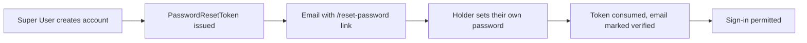

# Trade Tender

A UK construction tendering marketplace connecting Clients with registered Retailers, built with
Next.js, TypeScript, Tailwind CSS, Prisma, and NextAuth. See [docs/TradeTender-Business-Plan.md](docs/TradeTender-Business-Plan.md)
for the full product and business specification.

## Status

This repository has a working backend vertical slice for the approved Trade Tender flow: authentication,
tender creation and matching, staged visibility, Retailer unlock, quote submission/comparison,
Client acceptance, and a contact-release workflow with audit logging.

The application now includes a server-side moderation layer that blocks or reviews suspicious content
before it is shared, including contact details, direct outside-platform communication attempts,
company identifiers, URLs, and other information that should stay within the platform until the
correct payment or authorization conditions are met. Content moderation events are recorded to the
append-only moderation audit trail, and the Contact-Release workflow only exposes the counterparty's
contact details after the server has confirmed the release payment.

Client quote comparison supports sortable side-by-side fields, best-value indicators, and a
server-generated PDF export. Payments are scaffolded against Stripe but run in a **dev-only
fallback** until real Stripe keys are configured (see [Payments](#payments) below). The UI follows
an enterprise-SaaS visual standard using a shared component kit in `src/components/ui/`, and each
role has its own dedicated sidebar navigation (`src/components/layout/AppShell.tsx`, configured in
`src/lib/navigation.ts`) grouped into logical sections using construction-industry terms.

The Super User area includes an executive analytics dashboard with filters, decision insights, charts
for tender volume/conversion/regional activity, category performance, CSV export, and drill-down
links. First-time Client and Retailer flows include clearer role onboarding, explicit fee/privacy
explanations, and resumable accepted-quote payment state after refresh. Sign-in uses a single
server-authorized routing path to exactly one workspace (`/client`, `/retailer`, or `/super-user`).
Accounts with both Client and Retailer memberships see a workspace selector in the authenticated
dashboard header, and switching is revalidated against persisted role membership on the server.
Tender saving preserves the draft and reports actionable validation, server, or connection errors.
Retailer profile and team management is available from the Retailer workspace, including company
details, operational counties, service categories, master-user designation, and team permissions.
Transactional email uses a central corporate template library for retailer invitations, matched
tender alerts, quote events, payment events, contact release, account updates, password reset, and
failed-payment recovery. Resend delivery is server-only and controlled by environment variables:
`RESEND_API_KEY` and `EMAIL_FROM` are set per environment, with no hardcoded sender fallback.
New account registrations notify the address in `REGISTRATION_NOTIFICATION_EMAIL` when Resend is
configured; the notification contains role and contact details but never a password or
authentication secret.
New Client and Retailer accounts receive a single-use email-verification link that expires after 24
hours. Unverified accounts cannot sign in. Accounts created by a Super User instead receive a
single-use password-reset link so the holder sets their own password — see
[Account creation and password reset](#account-creation-and-password-reset).
Super Users can edit categories, payment fees, Client acceptance fee mode, membership tiers,
annual subscription plans, and Retailer assignments. Client acceptance fees support a fixed amount
or separate percentage rules for quote values up to £10,000 and above £10,000. Retailers and Clients
can use tender-scoped internal messaging after a Retailer unlocks an opportunity; messages are
moderated for contact, company, contract, and off-platform information. Client companies receive a
unique Trade Tender ID for retailer quoting, and retention jobs delete unpurchased quotes and
documents after 30 days while purchased records are retained for five years.
Super Users can also activate a paid sponsored-placement product for Retailers; purchased placements
appear in a separate labelled area on Client quote pages and do not change quote ranking or sorting.

Within the Super User role, an **Owner** flag gates the most critical controls — fees, adspace,
membership tiers, sponsored placement, and creating or managing other Super User accounts — from the
Owner Console at `/super-user/owner`. An **Accountant** flag restricts a Super User sub-account to a
read-only Accounting Space (`/super-user/accounting`) with receipts, invoices, and performance
reporting only, with no access to Super User settings or user management. Both are attributes on the
existing Super User role, not additional roles, and both account types are created only by a full
Super User. The Retailer Performance dashboard now surfaces trends, category/regional performance,
quote value, response time, and platform benchmark sections, each independently toggleable from Site
Settings.

A structured production-readiness review (architecture, security, backend correctness, QA, brand/UI,
and deployment) was completed on 2026-08-28; see
[docs/PRODUCTION-READINESS-REVIEW.md](docs/PRODUCTION-READINESS-REVIEW.md) for fixed findings and
remaining outstanding items. The Azure SQL migration path and missing deploy pipeline recorded there
were superseded on 2026-08-30 by the move to Render hosting with a single PostgreSQL datasource.
The database provider is being moved from Render PostgreSQL to Neon Lakebase Postgres; runtime
traffic uses the pooled Neon URL and Prisma migrations use the direct Neon URL.

See [Outstanding Tasks](#outstanding-tasks) for the remaining production-hardening work.

## Action Required Before The Next Deploy

Nothing in this list can be done from the repository — each needs a value or a decision from the
platform owner. The first item will break a deploy if skipped.

### 1. Rotate the shared Neon database password — blocking

The staging and production Neon connection strings were shared during setup. Treat both passwords as
exposed and rotate the Neon role password before production use. Update every dependent environment
variable immediately after rotation.

### 2. Set Neon database URLs on both Render services — blocking

Both Render web services must use Neon rather than the old local or Render-managed database. Set
`DATABASE_URL` to the pooled Neon connection string and `DATABASE_URL_UNPOOLED` to the direct,
non-pooler Neon connection string. Prisma uses `DATABASE_URL_UNPOOLED` for migrations so schema
deploys do not run through PgBouncer.

Do not commit these values. Set them in the Render dashboard or via a secret manager only.

### 3. Set `NEXTAUTH_URL` on both Render services — blocking

The application now throws when this is missing rather than guessing a default, so a service without
it fails its build. That is deliberate: the previous silent fallback pointed verification and
contact-release links at `localhost`. Values are in
[Environment origins](#environment-origins).

This variable also governs every server-issued redirect — post-login workspace routing, the
middleware role guards, and email verification. Behind Render's proxy the incoming request host is
the internal listener (`localhost:10000`), so a redirect derived from the request instead of
`NEXTAUTH_URL` sends the browser to an unreachable host. That was the cause of the
`https://localhost:10000/super-user` failure after sign-in on staging.

**Still to verify:** sign in on each deployed service and confirm the post-login URL is that
service's own public origin.

### 4. Set the remaining per-service variables in the Render dashboard

Everything marked `sync: false` in [render.yaml](render.yaml) is unset by design.

| Variable | Production | Staging |
| --- | --- | --- |
| `NEXTAUTH_URL` | `https://trade-tender.onrender.com` | `https://tender-m0xw.onrender.com` |
| `DATABASE_URL` | pooled Neon application database URL | pooled Neon application database URL |
| `DATABASE_URL_UNPOOLED` | direct database URL for Prisma migrations | direct database URL for Prisma migrations |
| `STRIPE_SECRET_KEY` | live key | test key |
| `STRIPE_WEBHOOK_SECRET` | from the production webhook | from a **separate** staging webhook |
| `RESEND_API_KEY` / `EMAIL_FROM` | verified sending domain | separate key and sender |
| `REGISTRATION_NOTIFICATION_EMAIL` | internal recipient | internal recipient |
| `RETENTION_JOB_SECRET` | long random string | long random string |
| `NEXT_PUBLIC_SENTRY_DSN` / `SENTRY_DSN` | project DSN | project DSN |
| `SENTRY_AUTH_TOKEN` / `SENTRY_ORG` / `SENTRY_PROJECT` | build-time, for source maps | optional |
| `NEXT_PUBLIC_SUPPORT_EMAIL` | optional; links hide when unset | optional |

### 5. Keep production and staging on separate Neon databases or branches

Production must not share the same writable database target as staging. Use separate Neon projects,
or at minimum separate Neon branches with distinct pooled and direct connection strings. Run
production migrations only against the production direct URL.

### 6. Seed the platform owner in the intended Neon environment

`npm run db:seed` refuses to run when `NODE_ENV=production`, but it will seed whichever database the
current `DATABASE_URL` points at. Before running it for staging, confirm the active host is Neon and
not `localhost`, then seed the owner account from `PLATFORM_OWNER_EMAIL` and
`PLATFORM_OWNER_PASSWORD`.

### 7. Register two Stripe webhooks, not one

Each environment needs its own endpoint at `https://<host>/api/webhooks/stripe`, producing a
different signing secret. Sharing one secret makes signature verification fail on the other
environment, and payments then stop confirming with no visible error.

### 8. Verify the Resend sending domain

Until the DNS records are in place, verification and contact-release emails will bounce or be
filtered, which blocks registration entirely. `EMAIL_FROM` must use that verified domain; there is
no fallback sender, so an unset value means nothing is sent.

Confirm each environment with [Email delivery test](#email-delivery-test) once the keys are in
place. It distinguishes an unset variable (`503`) from an unverified domain (`502`).

If you previously set `RESEND_FROM_EMAIL` in Render, delete it — the application no longer reads it,
and leaving it in place makes email look configured when it is not.

### 9. Point the retention job at production

The purge still runs from GitHub Actions. Update the `RETENTION_JOB_URL` repository secret to the
production host's `/api/internal/retention`, and set `RETENTION_JOB_SECRET` to match the service.

### 10. Confirm the Render blueprint adopts the existing services

Both services were created by hand, so the first blueprint sync must *adopt* them. Check that Render
offers to **update** `Trade Tender` and `Tender Staging` rather than create them — creating would
give you duplicates.

### 11. Redeploy so the corrected migrations apply

The 2026-08-30 migrations were committed in SQLite dialect and PostgreSQL rejected them, so
`prisma migrate deploy` failed during the Render build and `Tender.supplyDate` was never created —
production then raised `P2022` on every tender query. The migrations are now PostgreSQL and verified
against a clean database, but the fix only reaches an environment on its next deploy.

Redeploy staging and production, confirm the build log shows the migrations applying rather than
erroring, and re-run a tender query. If a database was left partially migrated, check
`SELECT * FROM "_prisma_migrations" WHERE finished_at IS NULL;` and resolve any failed entry with
`npx prisma migrate resolve` before deploying again.

## Decisions Made On Your Behalf

Points worth reviewing, each a deliberate trade-off rather than an oversight.

- **`next build` no longer type-checks or lints.** With Sentry wired in, the in-build type-check
  worker died and the build exited `0` with no output — a silent failure. `typescript.ignoreBuildErrors`
  and `eslint.ignoreDuringBuilds` are set in [next.config.mjs](next.config.mjs), and `npm run type-check`
  and `npm run lint` were added to the Render build command so the gate still runs on every deploy.
  Revert if Render's build environment proves to have more memory than the dev container.
- **Sentry runs with errors and tracing only.** Session Replay, logging, profiling and the
  `dataCollection` option are all switched off, and `includeLocalVariables` is `false`. Each of them
  would capture DOM content, HTTP bodies or server locals — exactly where pre-release Client and
  Retailer contact details live. Enabling any of them needs a deliberate masking review first.
- **Production and staging report to Sentry as separate environments** via `SENTRY_ENVIRONMENT`.
- **Partner links in the footer stay hardcoded.** They are fixed third-party sites, identical in
  every environment. Only the support address moved to configuration.

## Known Gaps

- **Attachments have nowhere durable to live.** Render's filesystem is ephemeral, so uploaded tender
  documents are lost on every redeploy. This conflicts directly with the 30-day quote retention and
  five-year accepted-quote retention rules, and needs external object storage (S3, R2 or similar)
  before any real Client uploads a file. This is the largest remaining gap.
- **No error has been confirmed in Sentry yet.** The SDK is wired but unverified end to end, because
  it needs a DSN and a real triggered error.
- **The health check validates migrations against SQLite, not PostgreSQL.** The `migration-validation`
  check in [scripts/health-check/lib/checks.mjs](scripts/health-check/lib/checks.mjs) replays the
  history into a `file:` database, so it reported PASSED while the committed migrations used
  SQLite-only syntax that PostgreSQL rejects. It cannot catch a dialect error. CI does replay the
  history against a real PostgreSQL service container, so the gate exists — but the health-check
  report should not be read as evidence that migrations deploy.

## Roles

- **Client** — creates tenders, receives and compares quotes, accepts a quote, and pays the
  Accepted Quote Release Fee.
- **Retailer** — manages categories and coverage, receives matched tender summaries, unlocks full
  tender details, and submits quotes.
- **Super User** — manages platform activity, categories, fees, memberships, subscriptions, and
  partner advertising. Two attributes on this role narrow access further: **Owner** (critical
  settings and Super User account management) and **Accountant** (read-only Accounting Space only).

## Navigation

Each role has its own sidebar (`src/lib/navigation.ts`), grouped by task:

| Client | Retailer | Super User |
| --- | --- | --- |
| Dashboard | Dashboard | Dashboard |
| Create Tender | New Opportunities | Tender Management |
| My Tenders | Unlocked Tenders | Retailer Management |
| Quotes Received | Submitted Quotes | Client Management |
| Awarded Projects | Performance | Payment Monitoring |
| Billing | Billing | Analytics |
| Profile | Profile | Categories |
| | | Site Settings |
| | | Accountant Management |
| | | Accounting Space |
| | | Owner Console (Owner only) |

An Accountant sub-account only ever sees Accounting Space; every other Super User page redirects it there.

## Outstanding Tasks

The core product flow is now implemented and verified. See
[docs/PRODUCTION-READINESS-REVIEW.md](docs/PRODUCTION-READINESS-REVIEW.md) for the full, prioritized
list from the latest structured production-readiness review, including a dedicated
[Business Plan Alignment Assessment](docs/PRODUCTION-READINESS-REVIEW.md#business-plan-alignment-assessment-2026-08-28).
Highlights:

- [x] **Database path resolved:** the app now uses one PostgreSQL datasource in every environment, with a single migration history applied by `prisma migrate deploy`.
- [x] **Migrations are PostgreSQL-valid:** the 2026-08-30 migrations were generated against SQLite (`PRAGMA` table rebuilds, `DATETIME`, `REAL`) and failed on Render, leaving `Tender.supplyDate` missing and production raising `P2022`. The history now applies to a clean PostgreSQL database with no drift against [prisma/schema.prisma](prisma/schema.prisma).
- [ ] Redeploy staging and production so the corrected migrations actually apply (see [Action Required item 11](#11-redeploy-so-the-corrected-migrations-apply))
- [x] **CI/CD baseline implemented:** GitHub Actions gates lint, type-check, tests, and production build on PRs and pushes to `main` and `staging`; Render deploys from git using [render.yaml](render.yaml).
- [x] **Auth abuse hardening in repo:** login and registration routes now enforce a simple in-app rate limit using source IP headers.
- [x] **Error monitoring wired:** Sentry (`@sentry/nextjs`) covers the browser, Node and Edge runtimes with errors and tracing. Still needs a DSN and one confirmed event — see [Known Gaps](#known-gaps).
- [x] **No hardcoded URLs:** every absolute URL resolves through `NEXTAUTH_URL` via [src/server/config/appUrl.ts](src/server/config/appUrl.ts), which throws rather than falling back.
- [x] **Post-login redirects fixed:** the workspace router, middleware role guards, and email verification build absolute redirects from `NEXTAUTH_URL` instead of the proxied request host, which behind Render resolved to `localhost:10000`.
- [ ] Confirm on each deployed service that sign-in lands on that service's public origin (see [Action Required item 3](#3-set-nextauth_url-on-both-render-services--blocking))
- [x] **Super-User-created accounts can sign in:** they now receive a single-use password-reset link, which also marks the address verified. Previously these accounts were permanently locked out.
- [x] **Email configuration is fully environment-driven:** `EMAIL_FROM` replaced the hardcoded `notifications@example.com` fallback, and `POST /api/internal/test-email` verifies delivery per environment.
- [ ] **Critical:** durable object storage for tender attachments — Render's filesystem is ephemeral and loses uploads on redeploy, breaking both retention rules
- [ ] **Critical (business plan §4.9):** misuse/fraud monitoring — repeated parties, unusual payment
  behaviour, duplicate/near-duplicate tenders — is not implemented
- [x] Super User management actions for users and waivers, plus Owner/Accountant governance tiers
- [x] Data retention job for 30-day non-accepted quote deletion and five-year accepted quote locks (SEC-100/101)
- [ ] Configure real Stripe keys and test signed webhooks, refunds, and chargebacks against a live/test Stripe account
- [ ] Partner advertising management (currently static placeholders; business plan §10 requires this to be
  Super-User-managed, not hardcoded)
- [ ] Super User analytics filters are missing status, value band, payment status, subscription plan, and
  Client/Retailer/identifier search required by business plan §4.6
- [ ] Clarify whether a formal Retailer approval/vetting gate is required before matching begins (§10 Phase Three)
- [ ] Visual/accessibility QA pass with real screen readers and devices
- [ ] Standalone toast/notification system for success/error feedback beyond inline button and form states
- [ ] First-time journey usability testing with real Clients and Retailers
- [ ] Suspend/edit actions on the new Super User Retailer/Client/Tender management pages
- [ ] Manual QA of the mobile sidebar drawer on real devices
- [ ] Secure supporting-document storage and downloads for Retailer quote documents
- [ ] Load/performance testing evidence against the 1,000-concurrent-user target (§4.10)
- [x] Retailer analytics expansion (trends, category, regional, quote value, response time, benchmark)
- [ ] Integration/E2E test coverage for unlock, payment, webhook, and contact-release journeys
  (see docs/PRODUCTION-READINESS-REVIEW.md for the specific gaps)

## Tech Stack

- **Framework**: Next.js 14 (App Router), TypeScript
- **Styling**: Tailwind CSS, next/font (Archivo + Inter)
- **Database**: Prisma ORM — PostgreSQL in every environment (Docker locally, Render PostgreSQL when deployed)
- **Auth**: NextAuth (Auth.js) credentials provider, bcrypt-hashed passwords, JWT sessions
- **Payments**: Stripe (checkout sessions + signature-verified webhook)
- **Monitoring**: Sentry (`@sentry/nextjs`) — errors and tracing across browser, Node and Edge runtimes
- **Validation**: Zod

## Getting Started

### Prerequisites

- Node.js 20.x (pinned via `engines` in `package.json`)
- npm
- Docker (for the local PostgreSQL database)

### Installation

```bash
git clone https://github.com/Jondoe0285/Tender.git
cd Tender
npm install
```

### Environment variables

Copy `.env.example` to `.env` and fill in the values:

```bash
cp .env.example .env
```

| Variable | Notes |
| --- | --- |
| `DATABASE_URL` | PostgreSQL connection string used by the running application. On Neon this must be the **pooled** URL. Set it per service; it is not supplied automatically. |
| `DATABASE_URL_UNPOOLED` | Direct, non-pooler PostgreSQL URL. Prisma uses it for migrations so schema deploys do not run through PgBouncer. Locally this can match `DATABASE_URL`. |
| `NEXTAUTH_SECRET` | Long random string. Generate with `node -e "console.log(require('crypto').randomBytes(32).toString('base64'))"`. |
| `NEXTAUTH_URL` | **Required in every environment.** The full public origin of this deployment. Email links, Stripe redirect URLs, server-issued redirects, and the same-origin API check all derive from it; the app throws rather than guessing a default. |
| `ADDITIONAL_ALLOWED_ORIGINS` | Optional, comma-separated. Extra origins this deployment also answers on, such as a custom domain beside the platform host. Without it the same-origin check rejects requests on the second hostname. |
| `NEXT_PUBLIC_SUPPORT_EMAIL` | Public support address shown in the footer and policies page. The links are hidden when unset. |
| `RESEND_API_KEY` | Required to deliver email-verification links to self-registered users. |
| `EMAIL_FROM` | Required sender, using a domain verified in Resend. There is no fallback — sends are skipped and reported when it is unset. |
| `REGISTRATION_NOTIFICATION_EMAIL` | Address that receives new-account notifications. |
| `STRIPE_SECRET_KEY` / `STRIPE_WEBHOOK_SECRET` | Leave blank locally — payment flows fall back to a dev-only confirmation endpoint when unset. Required in production. |
| `RETENTION_JOB_SECRET` | Secret used by the scheduled retention endpoint and CLI job. Required in production. |
| `NEXT_PUBLIC_SENTRY_DSN` / `SENTRY_DSN` | Browser and server Sentry DSNs. Leave blank to disable the SDK entirely — it initialises as a no-op. |
| `NEXT_PUBLIC_SENTRY_ENVIRONMENT` / `SENTRY_ENVIRONMENT` | Separates production from staging in Sentry. |
| `SENTRY_AUTH_TOKEN` / `SENTRY_ORG` / `SENTRY_PROJECT` | Build-time only. Source map upload turns on automatically once the token is present; without it production stack traces stay minified. |
| `PLATFORM_OWNER_EMAIL` / `PLATFORM_OWNER_PASSWORD` | Read by `npm run db:seed` to create the platform owner account. Never commit the password. |
| `TRADE_TENDER_ENV` / `SANDBOX_SEED_ENABLED` / `SANDBOX_USER_PASSWORD` | Deployed-sandbox demo seeding only. `db:seed` creates demo accounts solely when `TRADE_TENDER_ENV=sandbox` and `SANDBOX_SEED_ENABLED=true`. Leave unset in production. |

### Database setup

```bash
docker compose up -d    # start local PostgreSQL on port 5432
npm run db:generate     # generate the Prisma client
npm run db:migrate      # create/apply migrations
npm run db:seed         # create local development accounts
```

### Deployment (Render)

The app deploys to Render as a Node web service. [render.yaml](render.yaml) is the blueprint of
record — it defines the web service, the managed PostgreSQL instance, and every environment variable.
Values marked `sync: false` are per-environment or secret and must be set in the Render dashboard,
never in git.

- Build command: `npm ci && npm run type-check && npm run lint && npx prisma migrate deploy && npm run build`
- Start command: `npm run start` (Next.js binds to the `PORT` Render provides)
- Health check: `GET /api/health`

#### Environment origins

`NEXTAUTH_URL` is deliberately not committed, because a single value cannot be correct for both
services. Set it per service to that service's own origin:

| Environment | `NEXTAUTH_URL` |
| --- | --- |
| Production | `https://trade-tender.onrender.com` |
| Staging | `https://tender-m0xw.onrender.com` |
| Local | `http://localhost:3000` |

`ADDITIONAL_ALLOWED_ORIGINS` stays empty until a custom domain is added. When one is introduced, set
it on that service to the other origin the app answers on, comma-separated — otherwise the
same-origin check rejects every request arriving on the second hostname.

After the first deploy, confirm each of the following:

- `NEXTAUTH_URL` exactly matches the public origin, or sign-in, server-issued redirects, and the same-origin API checks will send users to the wrong host or reject requests
- the Stripe webhook endpoint points at `https://<your-render-host>/api/webhooks/stripe`, with the resulting signing secret stored as `STRIPE_WEBHOOK_SECRET`
- the Resend sending domain is verified and `EMAIL_FROM` uses it
- smoke checks pass for authentication, role isolation, payment state, and contact-release privacy

### CI

`.github/workflows/ci.yml` runs `npm run lint`, `npm run type-check`, `npm test`, and `npm run build`
against a throwaway PostgreSQL service container on pushes and PRs to `main` and `staging`.

### Email delivery test

`POST /api/internal/test-email` verifies Resend for whichever environment serves the request. It
requires a signed-in Super User and always sends to that Super User's own address, so it cannot be
used to mail anyone else. It carries no account, tender, quote or contact data.

Sign in to staging as a Super User, then from the browser console on that origin:

```js
await fetch('/api/internal/test-email', { method: 'POST' }).then((r) => r.json());
```

| Response | Meaning |
| --- | --- |
| `200 { status: 'sent', messageId }` | Resend accepted the message |
| `503` | `RESEND_API_KEY` or `EMAIL_FROM` is not set on this service |
| `502` | Resend rejected it — usually an unverified sending domain |
| `403` | Not a Super User, or a cross-origin request |

The same endpoint works in production; it is safe there because the recipient is always the caller.

### Account creation and password reset

When a Super User creates a Client or Retailer account, the holder is emailed a single-use link to
set their own password. No password is ever included in the message.



- The link expires after 24 hours and works exactly once. Issuing a new one invalidates the previous.
- Only the SHA-256 hash of the token is stored; the raw value exists solely in the email.
- Missing, expired and already-used tokens return the same message, so the endpoint cannot be used
  to probe which links exist.
- Completing the reset sets `emailVerifiedAt`, because following the link proves control of the
  mailbox. **This is required for sign-in** — see the note below.
- If delivery fails, the Super User sees a warning and the account stays listed; use *Reset password*
  on that account to issue a fresh link.

> Prior to this flow, Super-User-created accounts could never sign in: `authorize()` requires
> `emailVerifiedAt`, which account creation never set. Any accounts created before this change need a
> reset link issuing before their holders can log in.

The Super User form still asks for an initial password because it shares the self-registration
schema. That password is superseded as soon as the holder completes the reset.

### Quote retention job

`npm run retention:purge` deletes non-accepted quotes and their unpurchased tender documents submitted
more than 30 days ago and records each deletion in the audit log. In production, schedule that command
or `POST /api/internal/retention` daily with the `Authorization: Bearer $RETENTION_JOB_SECRET` header.
Documents linked to an accepted purchase remain locked for five years. The included GitHub Actions workflow runs daily; configure repository secrets
`RETENTION_JOB_URL` and `RETENTION_JOB_SECRET` to enable it.

### Seeded users

`npm run db:seed` creates or refreshes the platform owner and the following canonical sandbox
accounts. The Client and Retailer accounts use idempotent upserts, so each seed run restores them
to an active, verified sandbox state without creating duplicates.

| Role | Email | Password |
| --- | --- | --- |
| Super User | `PLATFORM_OWNER_EMAIL` from `.env` | `PLATFORM_OWNER_PASSWORD` from `.env` |
| Client | `client@example.test` | `SANDBOX_USER_PASSWORD`, or `TradeTenderDev!2026` locally when unset |
| Retailer | `retailer@example.test` | `SANDBOX_USER_PASSWORD`, or `TradeTenderDev!2026` locally when unset |

Set `PLATFORM_OWNER_EMAIL` and `PLATFORM_OWNER_PASSWORD` in the ignored `.env` file before
running the seed. The Retailer account includes a basic company profile and launch credits. The
seed command does not create tenders, quotes, payments, or production data.

For a deployed sandbox, set `TRADE_TENDER_ENV=sandbox`, `SANDBOX_SEED_ENABLED=true`, and a unique
`SANDBOX_USER_PASSWORD`; it is required and becomes the password for both permanent sandbox users.
This is the only production-mode exception; sandbox seeding remains blocked for every other environment.

Before seeding Neon, confirm the active database host ends in `.neon.tech` and is not `localhost`.
Use the pooled Neon URL for `DATABASE_URL` and the matching non-pooler URL for
`DATABASE_URL_UNPOOLED`.

### Run the app

```bash
npm run dev
```

Open [http://localhost:3000](http://localhost:3000) and register an account from `/register`.

### Building for production

```bash
npm run build
npm start
```

### Render deployment notes

The application runs as a Render Node web service with Neon Lakebase Postgres for persistence.
[render.yaml](render.yaml) describes the web services, while database credentials are set per
environment as secrets. Attachments still require private object storage; Render disks are not a
substitute, because the free plan has an ephemeral filesystem. Confirm `NEXTAUTH_URL`, the Stripe
webhook secret, and the verified Resend sender for each environment before treating a release as
production-safe.

## Payments

`STRIPE_SECRET_KEY` and `STRIPE_WEBHOOK_SECRET` are not set in this environment. Without them:

- Retailer unlock and Client release-fee payments are created as `PENDING` records with no Stripe
  checkout session.
- A dev-only endpoint (`/api/dev/confirm-payment`) lets you simulate payment confirmation locally.
  It refuses to run once Stripe is configured or `NODE_ENV=production`.
- The production webhook (`/api/webhooks/stripe`) verifies signatures against the raw payload and
  is the only path allowed to confirm payments in a real deployment.

## Database

`prisma/schema.prisma` is the single source of truth and targets PostgreSQL in every environment, so
local development and Render run identical migrations. After changing the schema, create a migration
and commit it:

```bash
npm run db:migrate
```

Render applies committed migrations with `prisma migrate deploy` during each build.

## Project Structure

```
next.config.mjs             # Wrapped with withSentryConfig
render.yaml                 # Render blueprint: both web services and the database
docker-compose.yml          # Local PostgreSQL
sentry.server.config.ts     # Sentry Node runtime
sentry.edge.config.ts       # Sentry Edge runtime
prisma/
├── schema.prisma           # PostgreSQL datasource for every environment
├── seed.ts                 # Creates local Super User, Client, and Retailer development accounts
└── migrations/
src/
├── instrumentation.ts        # Registers the Sentry server/edge config
├── instrumentation-client.ts # Sentry browser runtime
├── app/                    # Next.js routes and role portals
│   ├── page.tsx            # Role selection landing page
│   ├── login/, register/   # Auth pages
│   ├── reset-password/     # Set-password page for emailed reset links
│   ├── client/              # Client portal (dashboard, tender creation/detail)
│   ├── retailer/            # Retailer portal (dashboard, tender detail/unlock/quote)
│   ├── super-user/          # Super User dashboard (read-only)
│   └── api/                 # Route handlers (auth, tenders, quotes, payments, webhooks)
│       ├── health/                  # Render health check
│       └── internal/test-email/     # Per-environment Resend delivery test
├── components/
│   ├── ui/                  # Reusable UI primitives (Button, Card, StatusBadge)
│   ├── layout/              # Shared header, footer, account controls
│   └── providers/           # Client-side context providers (NextAuth session)
├── server/
│   ├── auth/                 # NextAuth config, session helpers, password hashing, reset tokens
│   ├── config/                # Application origin resolution (appUrl)
│   ├── data/                  # Prisma client singleton
│   ├── domain/                 # Business rules: tenders, matching, unlock, quotes, contact release
│   ├── payments/                # Stripe client and payment service
│   ├── audit/                    # Append-only audit log writer
│   └── http/                      # Shared API error mapping
├── lib/                     # Categories, identifier generators, Zod schemas
└── middleware.ts            # Role-based route protection
```

## Documentation

- [docs/TradeTender-Business-Plan.md](docs/TradeTender-Business-Plan.md) — business model, roles, and pricing
- [docs/Product-Requirements.md](docs/Product-Requirements.md) — functional requirements
- [docs/Architecture.md](docs/Architecture.md) — target architecture and trust boundaries
- [docs/Security-Requirements.md](docs/Security-Requirements.md) — security requirements
- [docs/branding/TradeTender-Brand-Rules.md](docs/branding/TradeTender-Brand-Rules.md) — brand and UI standards

## License

MIT
