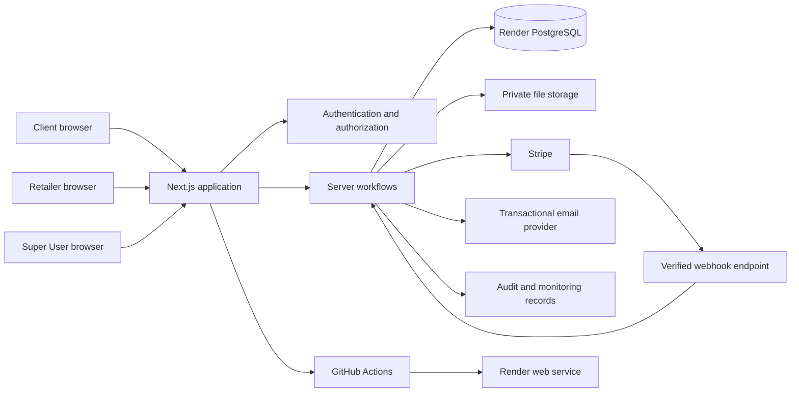
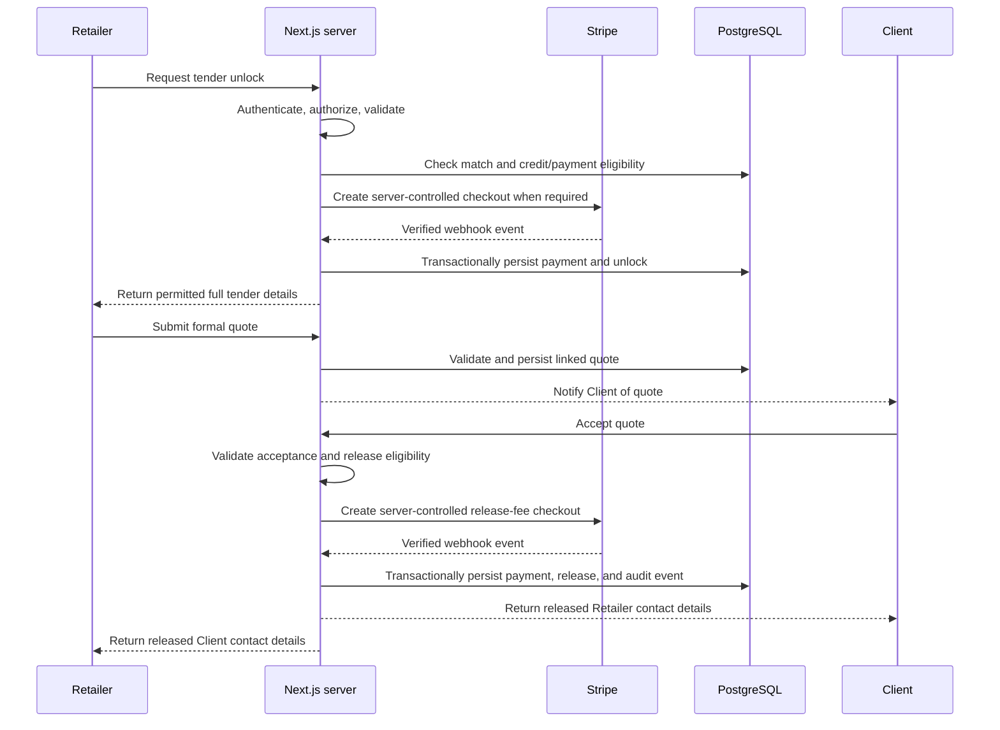

# Trade Tender Architecture

**Status:** Approved target architecture  
**Source documents:** [TradeTender-Business-Plan.md](TradeTender-Business-Plan.md), [Product-Requirements.md](Product-Requirements.md), and [Security-Requirements.md](Security-Requirements.md)

## 1. Architecture Intent

Trade Tender is a UK construction tendering platform for three roles: Super User, Client, and Retailer. The architecture must support structured tender creation, category and geographic matching, quote submission, comparison, payment-gated detail release, and auditable contact release.

This document describes the target production architecture. The existing repository is a Next.js prototype and must not be treated as evidence that production authentication, persistence, payment integration, or security controls are complete.

## 2. Approved Technology Boundaries

- **Web application:** Next.js with TypeScript.
- **UI:** Tailwind CSS and reusable accessible components.
- **Hosting:** Render.
- **Database:** Render PostgreSQL.
- **Payments:** Stripe through server-side integrations and verified webhooks.
- **CI/CD:** GitHub Actions for validation; Render deploys from the connected git branch.
- **Transactional email:** Approved email provider, such as the service described in the business plan.
- **Files:** Private object storage accessed through authorized server-controlled URLs. The Render application filesystem is ephemeral and must not be used for durable attachments.

No technology or service addition should expand the approved product scope without review against the business plan.

## 3. System Context



## 4. Trust Boundaries

### 4.1 Untrusted Boundaries

The following are untrusted and must not make security or business decisions:

- Browser form values and hidden fields.
- Query strings, route parameters, headers, cookies, and uploaded metadata.
- Client-side role, payment, ownership, unlock, waiver, and contact-release state.
- Stripe redirect or success-page parameters before server verification.
- Email links and notification actions until re-authorized server-side.
- Super User override requests until authenticated, authorized, validated, and audited.

### 4.2 Trusted Boundaries

- Server-side identity and session verification.
- Server-side authorization and ownership checks.
- Validated domain commands.
- Parameterised database access.
- Verified Stripe webhook events.
- Transactionally persisted payment and release state.
- Protected audit records and approved configuration.

Every transition from an untrusted boundary to a trusted state requires validation, authorization, and appropriate audit or transaction handling.

## 5. Application Structure

The application should be organized around clear ownership boundaries:

```text
src/
  app/                 Next.js routes, layouts, and role portals
  components/          Reusable accessible UI components
  features/            Tender, quote, payment, account, and reporting features
  server/
    auth/              Session and authorization services
    domain/            Business rules and workflow services
    data/              Repositories and database queries
    payments/          Stripe client, webhook verification, and reconciliation
    files/             Private attachment access and validation
    notifications/     Email composition and delivery
    audit/             Append-only event recording
  lib/                 Shared types, configuration, and safe utilities
  tests/               Unit, integration, and journey tests
migrations/            Versioned PostgreSQL migrations
```

The exact folders may follow existing repository conventions, but browser components must not contain database credentials, Stripe secrets, authorization decisions, or unrestricted data-access logic.

## 6. Request and Data Flow

A protected request follows this sequence:

1. Next.js receives the request.
2. The server resolves and validates the session.
3. The authorization layer checks role, account status, ownership, and workflow state.
4. The input schema validates and normalizes untrusted values.
5. The domain service applies the business rule, including payment and visibility conditions.
6. A repository executes parameterised database operations inside the required transaction boundary.
7. Sensitive state changes create audit events in the same consistency boundary where required.
8. The response mapper returns only fields permitted for the current role and workflow state.
9. Notifications, jobs, or provider calls receive the minimum approved data.
10. Errors are converted to safe public responses while retaining useful internal correlation data.

## 7. Role and Authorization Architecture

Authorization is deny-by-default and must be explicit at every server boundary.

### Super User

The Super User can manage approved platform configuration, users, categories, matching parameters, fees, launch credits, waivers, support, analytics, and audit review. Administrative actions require a current authenticated Super User session and are audited.

A Super User override may change an approved payment or launch-credit outcome only through a documented server-side command with a reason, actor, target, timestamp, and audit event. It must not silently expose data or bypass authorization.

### Client

Clients can access only their account, their tenders, their submitted project data, quotes returned against their tenders, and contact information released through an authorized accepted-quote payment or waiver.

### Retailer

Retailers can access only their account, capabilities, coverage, matched summaries, tenders they have legitimately unlocked, their submitted quotes, and contact information released through an authorized accepted-quote payment or waiver.

Resource IDs are never authorization. Every query must apply the authenticated principal, role, ownership, and workflow state.

## 8. Core Domain Components

### Account and Identity

Owns registration, login, sessions, role assignment, account status, terms acceptance, and authentication events. It does not allow a browser to select an elevated role or account status.

### Tender Management

Owns tender creation, structured project elements, identifiers, lifecycle status, deadlines, attachments, and Client ownership. It emits matching and notification work only after successful validation and persistence.

### Matching

Matches tender elements to active Retailer capabilities and geographical coverage. Matching must not reveal protected project or contact information to the matching process consumers beyond what is required for approved notification summaries.

### Unlock and Visibility

Calculates whether a Retailer has a valid launch credit, verified paid unlock, or approved waiver. It is the sole domain boundary for changing tender visibility.

### Quote Management

Owns quote submission, validation, linked quote identifiers, quote lifecycle, comparison data, acceptance, and retention state. It only permits submissions for authorized unlocked tenders.

### Payment

Owns server-controlled fee calculation, Stripe checkout creation, webhook verification, payment reconciliation, refunds, waivers, idempotency, and payment state transitions.

### Contact Release

Owns the final release of Client and Retailer contact details. It must query trusted payment or waiver state, authorize both parties, write the release audit event, and return only the permitted contact data.

### Audit and Monitoring

Owns append-only payment, unlock, quote, contact-release, authorization, administrative, retention, and suspicious-activity events. Logs must exclude secrets and unnecessary personal data.

### Reporting

Reads authorized, minimized projections of operational data. Reports must enforce the requesting Super User’s scope and must not become an alternate path to restricted Client or Retailer details.

## 9. Visibility State Model

The platform should model visibility explicitly rather than infer it from browser state.

| State | Retailer can see | Client can see |
| --- | --- | --- |
| Matched summary | Approved category, broad location, headline requirement, indicative timing, non-sensitive notes | Own tender and status |
| Retailer unlocked | Full tender information needed to quote, including approved attachments | Own tender |
| Quote submitted | Own quote and permitted tender data | Quote comparison without Retailer contact details |
| Quote accepted, payment pending | No contact release | Accepted quote, no contact release |
| Release payment confirmed or approved waiver | Released Client contact details where authorized | Released Retailer contact details where authorized |

The API, server-rendered output, email, files, exports, caches, and client state must enforce the same model.

## 10. Payment and Contact-Release Flow



A redirect or client success message is never sufficient proof of payment. Webhook handling must verify signatures, deduplicate events, tolerate retries and ordering differences, and derive entitlement from trusted persisted state.

## 11. Data Architecture

Render PostgreSQL should contain normalized, access-controlled records for:

- Users, roles, sessions, terms acceptance, and account status.
- Retailer capabilities, categories, service areas, accreditations, and preferences.
- Tenders, project elements, locations, deadlines, statuses, and attachments.
- Tender-Retailer matches, notifications, launch credits, unlocks, and visibility state.
- Quotes, quote documents, identifiers, acceptance, and retention state.
- Payments, Stripe event references, fee configuration, refunds, waivers, and idempotency keys.
- Contact-release events, authorizing payment or waiver references, and released-data categories.
- Audit events, monitoring flags, partner links, public policy metadata, and platform settings.

All schema changes require a reviewed migration. Unique constraints should protect tender identifiers, quote identifiers, Stripe event IDs, idempotency keys, and any other state that must not duplicate.

## 12. Files and Attachments

- Store attachments in private object storage, not a public web root.
- Validate authenticated ownership, file size, extension, MIME type, content signature, and business context server-side.
- Normalize names and prevent path traversal, active content, oversized archives, and unsafe previews.
- Issue short-lived authorized download URLs only after the visibility state permits access.
- Do not enumerate, preview, cache, or expose Retailer attachments before unlock.
- Record security-relevant upload, access, rejection, release, and deletion events.

## 13. Notifications and Background Work

Email notifications and asynchronous jobs must carry only the minimum approved data for their recipient role. A notification must not become a bypass around portal authorization or payment-gated visibility.

Jobs should be idempotent and retryable. They must re-check authorization and current state before sending protected content, processing a release, or changing a workflow state. Failed delivery must not be treated as failed payment, failed persistence, or failed authorization.

## 14. Reporting and Analytics

Reporting uses read-only, minimized projections with explicit filters and role checks. The Super User dashboard should support tender, quote, payment, category, geographic, status, date-range, value-band, and subscription-state filters as approved by the business plan.

Exports require the same authorization and privacy checks as the dashboard. Contact details, precise site information, and full protected specifications must not appear unless the report is explicitly authorized and the relevant release state permits them.

## 15. Deployment Architecture

- GitHub Actions runs type checking, relevant tests, security checks, and a production build.
- Render hosts the Next.js application with environment-specific configuration.
- Database migrations run through `prisma migrate deploy` as an approved, ordered deployment step.
- Secrets are supplied through GitHub Actions secrets or Render environment variables marked as non-syncing.
- Development, test, staging, and production settings and data remain separated.
- Production releases require verified backups or recovery readiness before destructive migrations.
- Post-deployment checks verify application health, authentication, role isolation, payment state, and contact-release privacy.
- Releases must have rollback preparation and observable logs and metrics.
- Development and feature branches use local databases and local-only sandbox credentials for every supporting app and integration.
- Staging and production/main each have explicit, dedicated environment resources and branch-specific security permissions that must be preserved: databases, Stripe, Resend, Sentry, Cloudflare/DNS/WAF, authentication providers, analytics/product telemetry, object/file storage, monitoring and alerting, webhook endpoints, API credentials and service tokens, service URLs, access policies, role assignments, and deployment configuration.
- A destructive change to a staging or production/main environment resource, integration setting, or security permission requires recorded approval, affected resource names (never secret values), backup/rollback evidence, a change plan, and post-change validation evidence before it is applied.

A green build alone is not evidence that production payment, privacy, or authorization behavior is safe.

## 16. Observability and Audit

Operational logs should include correlation IDs, safe error context, latency, dependency outcomes, and workflow identifiers. They must not contain secrets, full payment credentials, unnecessary personal data, or protected contact details.

Audit records must be append-only or otherwise alteration-protected and include:

- Actor or system source.
- Event and target.
- Tender or quote identifier where applicable.
- Payment, waiver, or provider reference where applicable.
- Timestamp and correlation identifier.
- Released-data category for contact-release events.

Monitoring should flag unusual payment behavior, duplicate or near-duplicate tenders, repeated cancellations, repeated parties, excessive authorization failures, and suspicious contact-release activity.

## 17. Retention and Recovery

- Formal quotes are retained for 30 days from submission.
- Unsuccessful, expired, and non-accepted quotes are then deleted or anonymized unless a valid hold or investigation applies.
- Successful or accepted quotes, related tender identifiers, payment records, contact-release events, and audit logs are retained for five years.
- Retention jobs are authorized, repeatable, observable, and safe against legal holds.
- Database backups and recovery procedures are protected and tested.
- Deletion and anonymization outcomes are auditable.

## 18. Architecture Decision Rules

Before approving an architectural change:

1. Read the approved business plan and related requirements.
2. Identify the affected role, workflow, trust boundary, and protected data.
3. Confirm server-side authentication, authorization, validation, payment, and audit behavior.
4. Identify schema, migration, retention, deployment, testing, and rollback impact.
5. Prefer the smallest reusable design that fits the existing codebase.
6. Flag any conflict with the business plan before implementation.

## 19. Architecture Acceptance Gate

The target architecture is acceptable only when:

- Protected access is authenticated and authorized server-side.
- Client and Retailer details cannot be exposed before the required confirmed payment or approved waiver.
- Stripe webhooks are verified and idempotent.
- Database queries are parameterised and schema changes have migrations.
- Payment and contact-release state is transactionally consistent and auditable.
- Private files cannot be accessed through stale, public, or unauthorized URLs.
- Retention, backup, monitoring, and rollback behavior is defined.
- Responsive and accessible portal behavior is preserved.
- Relevant tests cover unit, integration, user journeys, security boundaries, failure paths, and release behavior.
- The design remains within the approved Trade Tender business plan.
